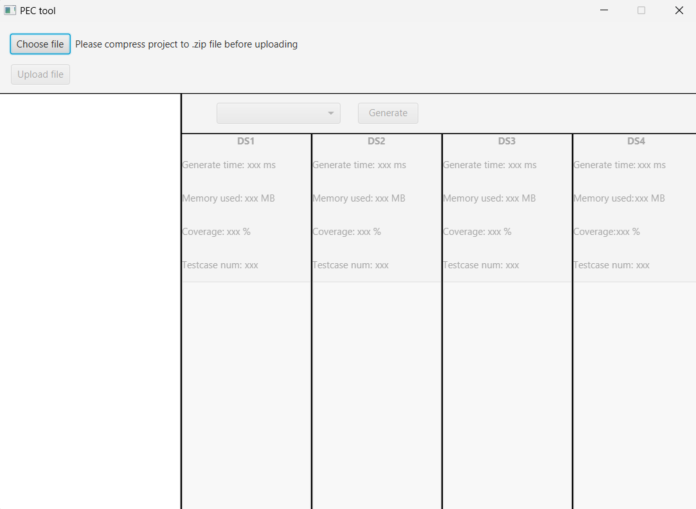
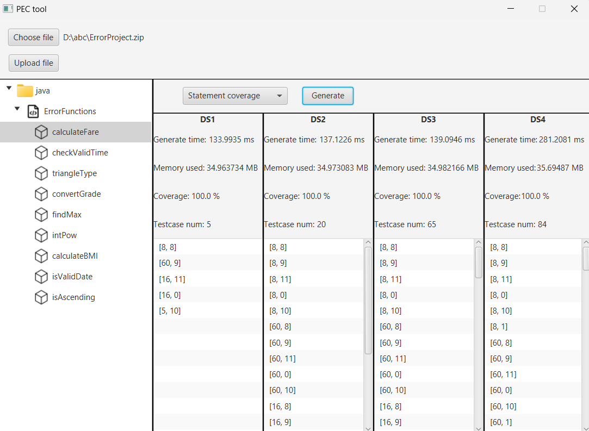

# PEC Tool: A Pairwise test data generation tool for Error detection in the Concolic testing method for Java Projects
## USER MANUAL
### Required environment
- Our implementation has been tested on the Windows, Intel®Core™i7-1165G7 CPU @ 2.80GHz, 16GBs RAM memory.
- IntelliJ IDEA, which is available [here](https://www.jetbrains.com/idea/download/)
- [Java 11 SDK](https://www.oracle.com/java/technologies/javase-jdk11-downloads.html)
- [Download JavaFX SDK (Version: 17.0.10, Type: SDK)](https://gluonhq.com/products/javafx/)
- [z3 solver (Version >= 4.12.2)](https://github.com/Z3Prover/z3)
  - Extract the downloaded file
  - Add the path to the `bin` folder to the system environment variable `PATH` or `Path`
## How to Run?
1. Clone and Open the project in IntelliJ IDEA
2. Add JavaFX SDK to the project (File -> Project Structure -> Libraries -> Add -> Java -> Select the lib folder of JavaFX SDK)
3. Edit Configuration 
   - New Configuration -> Application
   - Main class: `gui.Main`
   - Modify options -> Add VM options: `--module-path <path-to-lib-folder-of-javafx-sdk> --add-modules javafx.controls,javafx.fxml` (TODO: Change the path to your JavaFX SDK lib folder)
4. Run the project, the main screen looks like this:

5. Upload the project by clicking the `Choose file` button, then select the project folder.\
Note:
   - We have provided our experimental project - "ErrorProject" in the `sample` folder. The testing units in the project are common functions in research communities and the software industry. Details of these units are described as follows:
     - "calculateFare": Calculate the corresponding fare based on the input parameters 'age' and 'distance'.
     - "checkValidTime" : Take 'hour', 'minute', and 'second' as input parameters and determine whether they form a valid time. 
     - "triangleType": Print the type of a triangle based on three edges of a triangle 'a', 'b', and 'c'. 
     - "convertGrade": Return the corresponding letter grade (A, B, C, or D) based on the scores for the two subjects 'math' and 'english'. 
     - "findMax": Return the largest among the three integers 'n1', 'n2', and 'n3'. 
     - "intPow": Take 'number', 'index' as input parameters and calculate 'number' to the 'index'\textit{th} power. 
     - "calculateBMI": Calculate the corresponding Body Mass Index (BMI) based on the input parameters 'weight', 'height'. 
     - "isValidDate": Verify whether three parameters 'day', 'month', and 'year' form a valid date. 
     - "isAscending": Determine whether the four integers 'a', 'b', 'c', and 'd' are arranged in ascending order.
   - The project should be compressed into a zip file.
   - The project should contain the `java` folder, which contains the source code.
7. After the project is uploaded, choose the unit and then choose the coverage criteria.
8. Click the `Generate` button to start the testing process. The result will be displayed as below:

